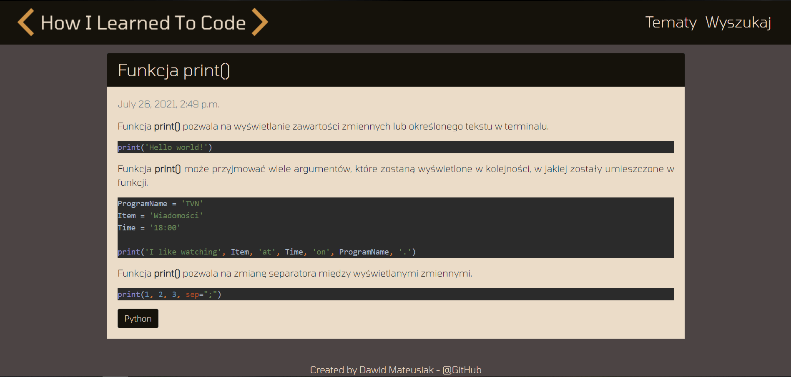

# How I Learned To Code
> Simple blog application used to save informations gained during programming learning.
# URL Adress
https://howilearnedtocode.herokuapp.com/
## Table of contents
* [Screenshots](#screenshots)
* [Technologies](#technologies)
* [Setup](#setup)
* [Features](#features)
* [Contact](#contact)

## Screenshots

* Home page with list of all posts

* Post detail view

* Topics list

* List of all posts in selected topic

  
* Search form

* Searching result view

## Technologies
* Python 3.9.2
* Django 3.2.3
* Bootstrap
* django-summernote

## Setup
To install and run app you will need to:
* Clone this repository to your computer or unpack .zip file in chosen directory,
* Run IDE or command line,
* Command in IDE to install demanded packages:
> pip install -r requirements.txt
* Run comand line,
* Type "cd YOUR_DIRECTORY\blogsite" in command line,
* Type "python manage.py migrate" in command line, 
* Type "python manage.py runserver 8000" in command line,
* Type "http://127.0.0.1:8000/" in your webbrowser.

## Features

* Adding posts and topics in admin view
* Advanced text editor (django-summernote)
* Possibility to display posts from selected topic
* Form enabling to search string in post title or content

## Contact
Created by [@matedawid](https://linkedin.com/in/matedawid) - if you have any questions, just contact me!
